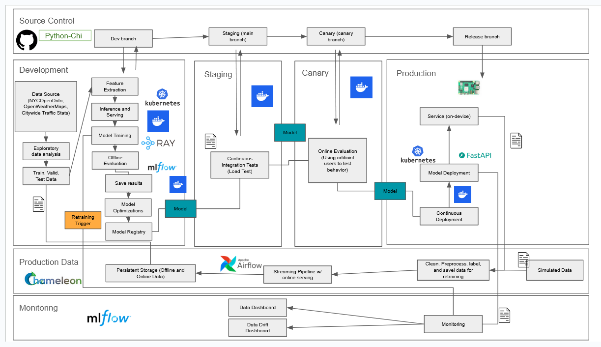
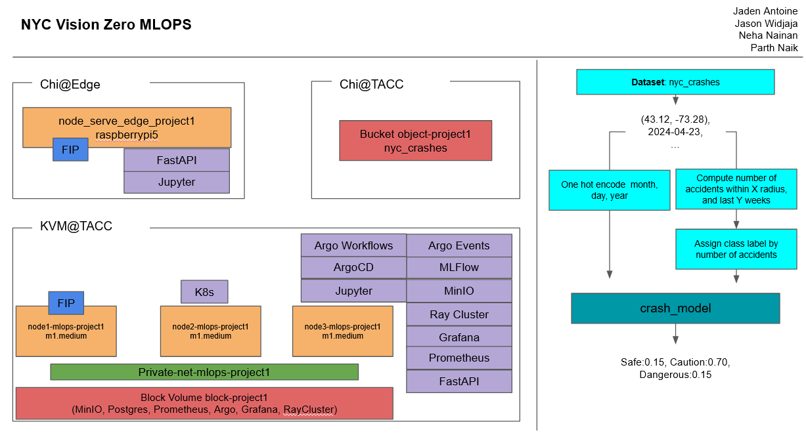

## NYC-Vision-Zero-MLOPS
<!-- 
Discuss: Value proposition: Your will propose a machine learning system that can be 
used in an existing business or service. (You should not propose a system in which 
a new business or service would be developed around the machine learning system.) 
Describe the value proposition for the machine learning system. What’s the (non-ML) 
status quo used in the business or service? What business metric are you going to be 
judged on? (Note that the “service” does not have to be for general users; you can 
propose a system for a science problem, for example.)
-->

### Value Proposition
Vision Zero hopes to reduce the amount of general vehicular related incidents. With our proposed system we can create a MLOPS pipeline using the various types of information present within our datasets to create a model, or models, to classify the risk of possible incidents on any given day. Classifications would be as follows, subject to change; Dangerous, Somewhat Dangerous, Average, Somewhat Safe, and Safe. The NYPD, NYCDOT, and other entities would also be able to use this information to better predict potential incidents based on existing daily conditions, leading to faster response times and safer roads.

<!-- Whats the non ML status Quo?-->
Current Vision Zero and other NYC agencies use the recorded data from the NYPD and Vision Zero initiative to push for legistlation for improvements in road safety. This is mainly displayed with dashboards and reports showcasing historical data. With our system we'll implement an ML solution to help with the classification of the danger level for the current area of the user.

<!-- What are the business metrics to measure?-->
Our goal with Vision Zero is to propose this system to various groups, such as the NYPD, DOT, Citibike, NYC government, MTA, Mailing services, news agencies and other entities with interest in the protection of pedestriants, drivers, and general NYC-goers. Our business metrics are focused on the reduction in fatal vehicular incidents over time, quantifiable by the reported Citywide Traffic Statistics from the DOT. As well as consistent to high user usage rate of the application, in addition to user trust in the reliablity of the classifications are also metrics we use to verify the efficacy of the application.

### Contributors

<!-- Table of contributors and their roles. 
First row: define responsibilities that are shared by the team. 
Then, each row after that is: name of contributor, their role, and in the third column, 
you will link to their contributions. If your project involves multiple repos, you will 
link to their contributions in all repos here. -->

| Name                            | Responsible for | Link to their commits in this repo |
|---------------------------------|-----------------|------------------------------------|
| Group 1                |                 |                                    |
| Jaden Antoine                   |  Model Training and Training Platforms             |         [Link](https://github.com/JadeAnt/NYC-Vision-Zero-MLOPS/commits/main/?author=JadeAnt)                           |
| Jason Widjaja                   |  Continuous X               |      [Link](https://github.com/JadeAnt/NYC-Vision-Zero-MLOPS/commits/main/?author=JasonW35214)                                 |
| Neha Nainan                     |  Data Pipeline               |          [Link](https://github.com/JadeAnt/NYC-Vision-Zero-MLOPS/commits/main/?author=nehaann23)                             |
| Parth Naik    |  Model Serving and Monitoring               |           [Link](https://github.com/JadeAnt/NYC-Vision-Zero-MLOPS/commits/main/?author=Parthnaik123)                            |

### System diagram

<!-- Overall digram of system. Doesn't need polish, does need to show all the pieces. 
Must include: all the hardware, all the containers/software platforms, all the models, 
all the data. -->

### Detailed System diagram

### Summary of outside materials

<!-- In a table, a row for each dataset, foundation model. 
Name of data/model, conditions under which it was created (ideally with links/references), 
conditions under which it may be used. -->

|              | How it was created | Conditions of use | Data Source Type | Links |    Size (S/M/L)  |   
|--------------|--------------------|-------------------|-------------------|-------------------|-------------------|
| Motor Vehicle Collisions - Crashes   |          Created from all police reported motor vehicle collisions NYC. Polce report is filled for all collisions where someone is injured, killed, or $1000 worth of damage is occured.          |       Under NYCOpenData terms of use we cannot use this data for any illegal purposes, we cannot redistribute it as our own, and we cannot alter the data posted on NYCOpenData.  [Link](https://data.cityofnewyork.us/Public-Safety/Motor-Vehicle-Collisions-Vehicles/bm4k-52h4/about_data)                 |       Dataset/API            |       [Link](https://data.cityofnewyork.us/Public-Safety/Motor-Vehicle-Collisions-Vehicles/bm4k-52h4/about_data)            |          Large         |
| Citywide Traffic Statistics   |         Sourced by the NYPD Traffic Stat program, taken on a bourough and city wide basis, updated monthly and weekly.         |       Under NYC.gov terms of use we cannot use this data for any illegal purposes, we cannot redistribute it as our own, and we cannot alter the data posted on NYCOpenData. [Link](https://www.nyc.gov/home/terms-of-use.page)            |       Dataset            |         [Link](https://www.nyc.gov/site/nypd/stats/traffic-data/traffic-data-trafficstat.page)          |         Large          |
| Vision Zero View Map |          Created from the Motor Vehicle Collisions - Crashes dataset, also linked here. Which was created from all police reported motor vehicles NYC.          |         Under NYCOpenData terms of use we cannot use this data for any illegal purposes, we cannot redistribute it as our own, and we cannot alter the data posted on NYCOpenData.   [Link](https://data.cityofnewyork.us/Public-Safety/Motor-Vehicle-Collisions-Vehicles/bm4k-52h4/about_data)              |         Data Visualization          |       [Link](https://vzv.nyc/)            |           N/A        |
| NYPD TrafficStat Map |         Created from the Citywide Traffic Statistics sourced from the NYPD Traffic Stat Program. All data is reflective of the most recent traffic stat period.          |           Under NYC.gov terms of use we cannot use this data for any illegal purposes, we cannot redistribute it as our own, and we cannot alter the data posted on NYCOpenData. [Link](https://www.nyc.gov/home/terms-of-use.page)               |         Data Visualization          |        [Link](https://trafficsafetyforum.nypdonline.org/)           |            N/A         |
| NYCOpenData |           Open source data set catalog sourced by agencies within NYC.       |         Under NYCOpenData terms of use we cannot use this data for any illegal purposes, we cannot redistribute it as our own, and we cannot alter the data posted on NYCOpenData.  [Link](https://data.cityofnewyork.us/Public-Safety/Motor-Vehicle-Collisions-Vehicles/bm4k-52h4/about_data)               |        Dataset Catalog           |        [Link](https://opendata.cityofnewyork.us/)           |           N/A          |
| OpenWeatherMap |          Open source API created by OpenWeather, a team based in London that tracks weather data hyperlocally around the world.          |          [Link](https://openweather.co.uk/storage/app/media/Terms/Openweather_website_terms_and_conditions_of_use.pdf)         |        Dataset/API         |        [Link](https://openweathermap.org/)           |          Medium         |
| BERT |         A large transformer model pretrained on a large corpus of English text, created by AI researchers at Google.      |      [Link](https://huggingface.co/google-bert/bert-base-uncased/blob/main/LICENSE)             |         Foundation Model          |         [Link](https://huggingface.co/google-bert/bert-base-uncased)    [Link](https://arxiv.org/abs/1810.04805)      |          Large         |

### Summary of infrastructure requirements

<!-- Itemize all your anticipated requirements: What (`m1.medium` VM, `gpu_mi100`), 
how much/when, justification. Include compute, floating IPs, persistent storage. 
The table below shows an example, it is not a recommendation. -->

| Requirement     | How many/when                                     | Justification |
|-----------------|---------------------------------------------------|---------------|
| `m1.medium` VMs | 4 for entire project duration                     | Needed to run our notebooks, code, and other features. Require 4 to have one for each project member to work within|
| `gpu_mi100`     | 4 hour block twice a week                         |      We will be attempting the difficulty point for Model Training and Training Platforms by training a BERT model, which is an LLM that will require a gpu for reduced training and inference times.          |
| Floating IPs    | 4 for entire project duration, 1 for sporadic use |        Needed for our networking to connect our resources and shared information across the network. Require 1 for each person and 1 for sporadic use       |
| `Rasberry-Pi 5` | 1 for entire project duration, 2 hour block twice a week |     As our deployments are on-device focused, an edge device is needed to allow us to test the efficiency of our model and pipeline. Both our canary and production environments will require an edge device for testing artifical users.        |

### Project Overview and Detailed design plan

<!-- In each section, you should describe (1) your strategy, (2) the relevant parts of the 
diagram, (3) justification for your strategy, (4) relate back to lecture material, 
(5) include specific numbers. -->

#### Model training and training platforms

<!-- Make sure to clarify how you will satisfy the Unit 4 and Unit 5 requirements, 
and which optional "difficulty" points you are attempting. -->
(1) Strategy

- We began with exploratory data analysis to analyze our [Motor Vehicles Crashes dataset](https://data.cityofnewyork.us/Public-Safety/Motor-Vehicle-Collisions-Vehicles/bm4k-52h4/about_data) , clean it, and found the features we hypothesized would be the best to work with starting out
- We decided on using the features of [’intersection_id’, ’accidents_6m’, ’accidents_1y’, ’accidents_5y’] as our model input
  - ’intersection_id’ = The combination of the on street and off street names of the intersection the crash occured
  - ’accidents_6m’ = The amount of accidents that occured in the last 6 months
  - ’accidents_1y’ = The amount of accidents that occured in the last 1 year
  - ’accidents_5y’ = The amount of accidents that occured in the last 5 years
- We chose our target variable to be based on the amount of accidents in the next 6 months or 'future_accidents_6m', as this seemed like the best time window to allow our model to make an informed prediction using our historical data.
- We trained, retrained, and tested various different machine learning models in order to find which performs the best for our multi-classification based problem and finally decided on a RandomForestClassifier Model called [crash_model.joblib](https://github.com/JadeAnt/NYC-Vision-Zero-MLOPS/blob/main/fastapi/crash_model.joblib), this is just an example of what the model looks like.
- Due to the nature of the data we had to incorporate a TimeSeriesSplit, as all of our data is ordered historically. This was critically important as this prevented our model from using future data points, or data it wouldnt have access to at its prediction time.
- To Track the experiments we performed with we used the MLFlow and Minio platforms
  - For our experiment tracking we utilized [MLFlow](https://github.com/JadeAnt/NYC-Vision-Zero-MLOPS/blob/main/k8s/platform/templates/mlflow.yaml) and saved any model artifacts within [Minio](https://github.com/JadeAnt/NYC-Vision-Zero-MLOPS/blob/main/k8s/platform/templates/minio.yaml)
    - Ran within our kubernetes cluster as defined by our configuration files
    - Saving the details of each run such using checkpointing to record accuracy, precision, recall, and f1_scores
    - This was critical as, due to the threat of prediction by mode, our model was in danger of simply using the most predicted class and overfitting to that. Leading to deceptively high accuracies. As such, accuracy was not the most important metric for us to look at and instead we decided to look at precision, recall, and f1 scores to best determine how the model best measured the accuracy of predictions and finding relavant instances of that prediciton.
- We scheduled training jobs using a Ray cluster for our continuous pipeline
  - Our [Ray](https://github.com/JadeAnt/NYC-Vision-Zero-MLOPS/blob/main/k8s/platform/templates/ray.yaml) Cluster is used to submit training jobs using our [training](https://github.com/JadeAnt/NYC-Vision-Zero-MLOPS/blob/main/train/opt_train.py) and [retraining](https://github.com/JadeAnt/NYC-Vision-Zero-MLOPS/blob/main/train/re_train.py) scripts
  - Using a head node to schedule/manage jobs, data, and serve a dashboard with 3 worker nodes.
  - An Argo workflow for [model training](https://github.com/JadeAnt/NYC-Vision-Zero-MLOPS/blob/main/workflows/train-model.yaml) using data from the object store on CHI@TACC and retraining on [production data](https://github.com/JadeAnt/NYC-Vision-Zero-MLOPS/blob/main/workflows/retrain-model.yaml) are also included
- All additional training code and references to training can be found within the [train](https://github.com/JadeAnt/NYC-Vision-Zero-MLOPS/tree/main/train) folder.

(2) Relevant Diagram Part

- Within the system diagram the bulk of the model training and training platforms section of the project functions within the Development environment.
- The data sourcing from our datasets, exploratory data analysis, model training, tracking with MLFlow, and scheduling using Ray cluster
- Data is stored within our persistent storage within Chameleon
- Using Docker containers to manage the different sections of the training pipeline
- A retrainning trigger (schedule-based, etc..) exists here as well to trigger model retraining
- Model versions will be stored in model registry within MLFlow
- Model will move to the Staging environment once all development steps have been completed

(3) Justification

- For our project, our end user would hypothetically use this on an edge device. As such it was important for our final model to be able to be deployed on such a device at all
- As we tested multiple models and optimizations, etc.. It was important that we keep track of all of these model and code versions. As such the need for MLFlow to track our changes and store our data was imperative to our project
- Also, the usage of a Ray cluster to manage our jobs is crucial for our continuous pipeline to work properly

(4) Lecture Material Reference

- Referring back to Units 4 and 5 in our lectures, we will be utilizing training with backpropagation in order to allow our models to learn the appropriate internal representations to better classify our data
- Furthermore, as it was previously stated in lecture, paying explicit attention to our model’s size, velocity, and budget is a MUST. As they need to be able to perform on an edge device with a relatively small model size, with decent velocity, and small budget. Thankfully our model is an extremely small size and can be easily ran on an edge device.

(5) Difficulty Points

- Scheduling hyperparameter tuning jobs
  - We also attempted to run [Ray Tune](https://github.com/JadeAnt/NYC-Vision-Zero-MLOPS/blob/main/train/train_tune.py) to perform hyperparameter optimization for tuning our model during training with a referenced [Argo Workflow](https://github.com/JadeAnt/NYC-Vision-Zero-MLOPS/blob/main/workflows/train-tune-model.yaml) to trigger to model tuning and training. However, we had to use a special package for sklearn as sklearn models need special overhead to work within a Ray cluster.

(2) Relevant Diagram Part

- Within the system diagram the bulk of the model training and training platforms section of the project functions within the Development environment.
- The data sourcing from our datasets, exploratory data analysis, model training, tracking with MLFlow, and scheduling using Ray cluster
- Data is stored within our persistent storage within Chameleon
- Using Docker containers to manage the different sections of the training pipeline
- A retrainning trigger (schedule-based, etc..) exists here as well to trigger model retraining
- Model versions will be stored in model registry within MLFlow
- Model will move to the Staging environment once all development steps have been completed

(3) Justification

- For our project, our end user would hypothetically use this on an edge device. As such it was important for our final model to be able to be deployed on such a device at all
- As we tested multiple models and optimizations, etc.. It was important that we keep track of all of these model and code versions. As such the need for MLFlow to track our changes and store our data was imperative to our project
- Also, the usage of a Ray cluster to manage our jobs is crucial for our continuous pipeline to work properly

(4) Lecture Material Reference

- Referring back to Units 4 and 5 in our lectures, we will be utilizing training with backpropagation in order to allow our models to learn the appropriate internal representations to better classify our data
- Furthermore, as it was previously stated in lecture, paying explicit attention to our model’s size, velocity, and budget is a MUST. As they need to be able to perform on an edge device with a relatively small model size, with decent velocity, and small budget. Thankfully our model is an extremely small size and can be easily ran on an edge device.

(5) Difficulty Points

- Scheduling hyperparameter tuning jobs
  - We also attempted to run [Ray Tune]() to perform hyperparameter optimization for tuning our model during training with a referenced [Argo Workflow]() to trigger to model tuning and training. However, we had to use a special package for sklearn as sklearn models need special overhead to work within a Ray cluster.

#### Model serving and monitoring platforms

(1) Strategy:
We serve the trained model using a [FastAPI-based REST API](https://github.com/JadeAnt/NYC-Vision-Zero-MLOPS/tree/main/fastapi). This API is containerized using Docker and deployed within KVM@TACC on our staging, canary, and production endpoints. The workflow to build the container image to be deployed can be found [here](https://github.com/JadeAnt/NYC-Vision-Zero-MLOPS/blob/main/workflows/build-container-image.yaml). 

To deploy the container image when needed we also created an additional [deploy container image workflow](https://github.com/JadeAnt/NYC-Vision-Zero-MLOPS/blob/main/workflows/deploy-container-image.yaml).

The endpoint will accept input data and return a risk classification label along with a confidence score. Since the model is expected to run on an edge device (e.g., Rasberry Pi 5), it must be both small and fast. These were some things we took into account when we were training the model. 

This edge device is also brought up and utilized to perform our offline evaluation, within a container on a rasberrypi5 as can be seen [here](https://github.com/JadeAnt/NYC-Vision-Zero-MLOPS/tree/main/edge).
Once deployed, we run an automated offline evaluation suite. This includes metrics like accuracy, precision, recall, and F1-score.

Following staging deployment, we conduct testing using synthetic input data to measure system latency, throughput, and failure rate. After staging passes, we run a canary evaluation using simulated users sending live-like inputs to the API. Each step is ran through the [promote-model workflow](https://github.com/JadeAnt/NYC-Vision-Zero-MLOPS/blob/main/workflows/promote-model.yaml). 

We used [Prometheus](https://github.com/JadeAnt/NYC-Vision-Zero-MLOPS/blob/main/k8s/platform/templates/prometheus.yaml) and [Grafana](https://github.com/JadeAnt/NYC-Vision-Zero-MLOPS/blob/main/k8s/platform/templates/grafana.yaml) within kubernetes cluster, for monitoring the state of our systems. 

To close the loop, predictions from production use will be logged, a subset labeled, and added to the training dataset for weekly re-training. We can trigger this retraining script from the retrain model workflow to train only on the production bucket.

(2) Diagram Description:

- The user sends input data to a FastAPI endpoint.
- The API loads the trained model, runs inference, and returns a prediction.

(3) Justification:
Serving the model via a REST API enables seamless integration with the frontend and supports scalable deployment. Edge-device constraints require us to optimize for size and latency. Continuous evaluation ensures the model remains accurate, fair, and robust over time, even as real-world conditions change.

(4) Lecture Material Reference:
This section directly aligns with Units 6 and 7. Unit 6 emphasized serving models efficiently and optimizing for performance, especially on constrained devices. Unit 7 introduced strategies for offline evaluation, load testing, canary deployments, and feedback loops to ensure model quality and responsiveness in production.

#### Data pipeline

<!-- Make sure to clarify how you will satisfy the Unit 8 requirements,  and which 
optional "difficulty" points you are attempting. -->

(1) Strategy
- Persistent Storage:  
  Provision persistent block storage on Chameleon to store all critical artifacts, including historical datasets and streaming data.
- Offline Data Pipeline:  
  - Data Sources:  
    - OpenWeatherMap (weather data)  
    - NYC Motor Vehicle Collisions Vehicles  
    - Citywide Traffic Statistics  
  - Process:  
    - Extraction: Schedule regular ETL jobs (using Apache Airflow) to pull updated datasets.
    - Transformation: Clean data by handling missing values, normalizing fields, and performing feature extraction.
    - Loading: Store the transformed data in persistent storage.
- Online Data Pipeline:  
  - Data Source:  
    - Edge Device (Raspberry Pi) providing real-time GPS location data.
  - Process:  
    - Data Simulation & Ingestion: Use a lightweight script (via REST API or MQTT) to simulate real-time GPS streaming.
    - Real-Time Processing: Ingest data into a streaming pipeline, applying minimal cleaning (e.g., timestamp validation, coordinate formatting).
    - Storage & Usage:  
      - Store the online data temporarily for immediate use by the Inference API.
      - Log the data in persistent storage for later model re-training and evaluation.

(2) Relevant Diagram Part
- The data pipeline in the system diagram is in the development phase and it begins with the collection of raw data from various sources. This data undergoes exploratory data analysis (EDA) to identify patterns and issues, followed by cleaning, preprocessing, and transformation for model readiness. 

- There is also a streaming pipeline in the system diagram which is used to handle real time data prediction. In the architecture, it’s integrated with online serving to handle dynamic, real-time data inputs and outputs.

(3) Justification
- Offline Pipeline:  
  Automates ingestion and ensures high-quality historical data for robust model training.
- Online Pipeline:  
  Simulates production conditions with real-time data ingestion, enabling immediate inference and continuous learning.
- Persistent Storage:  
  Decouples compute from data, ensuring reliability and ease of maintenance during scaling or system updates.

(4) Lecture Material Reference
- The implementation of data pipeline will reference the Lab 8 manual on Data pipeline. The contents listed for this section is subject to change when the reference is released.

(5) Difficulty Points 
- Data Dashboard:  
  Implement an interactive dashboard to visualize:
    - Real-time data ingestion rates.
    - Data quality metrics.
    - ETL job performance.

#### Continuous X

<!-- Make sure to clarify how you will satisfy the Unit 3 requirements,  and which 
optional "difficulty" points you are attempting. -->

(1) Strategy
- Infrastructure-as-code:
  - Resources on the Chameleon cloud infrastructure are provisioned in a declarative process using [Terraform](https://github.com/JadeAnt/NYC-Vision-Zero-MLOPS/tree/main/tf/kvm). 
  - [Ansible](https://github.com/JadeAnt/NYC-Vision-Zero-MLOPS/tree/main/ansible) is used to deploy and configure the 3-node Kubernetes cluster for this project, including setting up services such as Kubernetes dashboard, ArgoCD, and Argo Workflows. 
  - All configuration files are stored in this Github repository for full version control and traceability.

- Cloud-native:
  - All infrastructure changes are made by updating version-controlled configuration files (Terraform, Ansible, ArgoCD), avoiding manual alterations to live environments.
  - The project utilizes independently managed service [platforms](https://github.com/JadeAnt/NYC-Vision-Zero-MLOPS/tree/main/k8s/platform/templates) within [Kubernetes](https://github.com/JadeAnt/NYC-Vision-Zero-MLOPS/tree/main/k8s), including Prometheus, Grafana, MinIO, MLFlow, Postgres, and Ray.

- CI/CD and Continuous Training:
  - The project uses [Argo Workflows](https://github.com/JadeAnt/NYC-Vision-Zero-MLOPS/tree/main/workflows) to automate the entire ML lifecycle through various workflow templates. 
  - Redeployment is achieved by executing the build-container-image.yaml template after the build-initial.yaml template.

- Staged deployment
  - The deployment pipeline is structured into three environments: staging, canary, and production.
  - After the initial model is trained, a build container image workflow is triggered before deploying to the staging environment.
  - The promotion steps are automated and managed through the promote-model.yaml workflow template.

(2) Relevant Diagram Part
- The transfer of a model from the development environment, to the staging, canary, and then production is defined by the templates from Argo Workflows. Retraining is triggered when a model fails the offline evaluation, stopping its current promotion to the next environment until this is resolved. When transitioning from the canary to the production environment, a bare metal instance is reserved and deployed on the Chi@Edge cloud.

(3) Justification
- Using Git for version control of infrastructure enables reproducibility, auditability, and collaboration.
- Using scripts/configuration files allows for automation which reduces human error and ensures consistency.
- Direct execution on VMs will be avoided, ensuring portability and scalability.

(4) Lecture Material Reference
- The implementation of continuous X references the Lab 3 manual on DevOps for ML.

### How to Run on Chameleon

To run our project on chameleon please perform the following steps:

1. First setup an ssh key to connect to the following Chameleon Sites: KVM@TACC, CHI@EDGE, and CHI@TACC
2. Utilizing the notebooks within our [notebooks](https://github.com/JadeAnt/NYC-Vision-Zero-MLOPS/tree/main/notebooks) folder run the cells within the notebooks folder in numerical order
3. Running the first [notebook 0](https://github.com/JadeAnt/NYC-Vision-Zero-MLOPS/blob/main/notebooks/0_intro.ipynb) to connect to our environment on Chameleon
4. Run [Notebook 1](https://github.com/JadeAnt/NYC-Vision-Zero-MLOPS/blob/main/notebooks/1_setup_env.ipynb) to setup our environment, cloning our github repo to allow us to setup environment variables and kubespray. In this step also create Application Credentials on the KVM@TACC, CHI@EDGE, and CHI@TACC sites
5. Run [Notebook 2](https://github.com/JadeAnt/NYC-Vision-Zero-MLOPS/blob/main/notebooks/2_provision_tf.ipynb) to provision our terraform configuration as defined in our [tf](https://github.com/JadeAnt/NYC-Vision-Zero-MLOPS/tree/main/tf) folder, then bringing it up within chameleon. You can follow the steps within the notebook to bring up the infrastructure
6. Run [Notebook 3](https://github.com/JadeAnt/NYC-Vision-Zero-MLOPS/blob/main/notebooks/3_practice_ansible.ipynb) to test using ansible to configure our systems for us
7. Run [Notebook 4](https://github.com/JadeAnt/NYC-Vision-Zero-MLOPS/blob/main/notebooks/4_deploy_k8s.ipynb) to actually deploy our k8s structure using kubespray by first running our pre, k8s, and post confige playbooks to setup everything. After this we can access our Kubernetes Dashboard, ArgoCD, and Argo Workflows to manage our nodes and applications
8. Run [Notebook 5](https://github.com/JadeAnt/NYC-Vision-Zero-MLOPS/blob/main/notebooks/5_configure_argocd.ipynb) to use argo CD add platforms for our services like MLflow and Minio, whilst also bring up our application for our staging, canary, and production appslicaitons.
9. At this point our service and apps are up and running so you can test everything! Feel free to visit the Ray Dashboard (see how to below), Minio, MLFlow, Grafana, Prometheus, and the FastAPI endpoints for staging, canary, and production
10. Finally run [Notebook 8](https://github.com/JadeAnt/NYC-Vision-Zero-MLOPS/blob/main/notebooks/8_delete.ipynb) to delete our infrastruture. ALWAYS run this when done working to free resources for other to use within ChameleonCloud.

### Access Ray Dashboard
To access Ray cluster dashboard to see training jobs

- ssh -L ports_set_here -i ~/.ssh/ssh_key_here cc@floating_ip_here
- kubectl port-forward svc/ray-head -n nyc-vision-zero-platform ports_set_here
